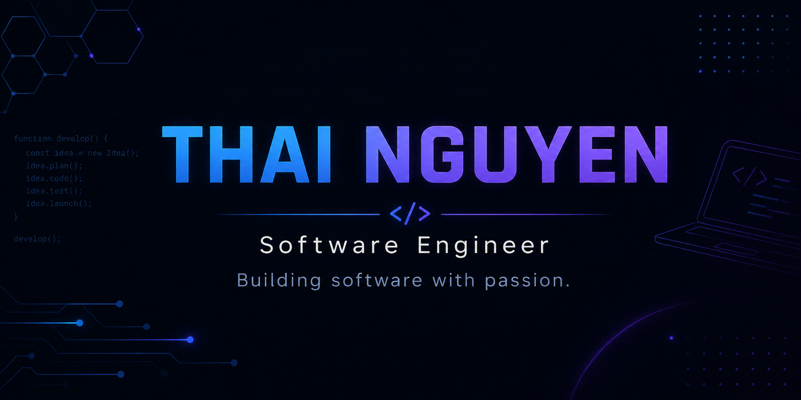

<p align="center">
  
</p>

<h1 align="center">Hi đŸ‘‹, I'm Thai Nguyen</h1>

<p align="center">
  
</p>

<p align="center"><b>Software Engineer • Backend Developer • Technology Enthusiast</b></p>

<p align="center">
Building software, exploring AI, and learning something new every day.
</p>

---

# đŸš€ About Me

```java
public class ThaiNguyen {

    String name = "Thai Nguyen";
    String role = "Software Engineer";
    String location = "Vietnam";

    String[] languages = {
        "Java",
        "Python",
        "JavaScript",
        "PHP"
    };

    String[] interests = {
        "Backend Development",
        "Software Architecture",
        "Artificial Intelligence",
        "Cloud Computing"
    };

    String currentlyLearning = "System Design";

    String motto = "Never stop building.";
}
```

---

# đŸ’» Tech Stack

### đŸ’» Languages

<p align="center">

</p>

### đŸŽ¨ Frontend

<p align="center">

</p>

### ⚙️ Backend

<p align="center">

</p>

### đŸ—„ Database

<p align="center">

</p>

### đŸ›  Tools

<p align="center">

</p>

---

# đŸ“ˆ GitHub Statistics

<p align="center">


</p>

---

# đŸ”¥ GitHub Streak

<p align="center">

</p>

---

# đŸ›  Current Focus

- ✅ Build production-ready software
- ✅ Improve Backend Development
- ✅ Learn Cloud Computing & DevOps
- ✅ Contribute to Open Source
- ✅ Practice Data Structures & Algorithms
- ✅ Learn something new every day

---

# đŸŒŸ Featured Projects

| Project | Description |
|---------|-------------|
| đŸ¨ Hotel Management System | Laravel • PHP • MySQL |
| đŸŽµ Audio Streaming Platform | HTML • CSS • JavaScript • PHP |
| đŸ¤– AI Automation Tools | Python automation and AI |
| đŸš€ More Projects | Coming soon... |

---

# đŸ† Achievements

- đŸŽ“ Information Technology Student
- đŸ’» Backend Developer
- đŸ¤– Artificial Intelligence Enthusiast
- đŸŒ Open Source Explorer
- đŸ“š Lifelong Learner

---

# đŸ‘€ Profile Views

<p align="center">

</p>

---

# đŸ“« Connect With Me

<p align="center">
<a href="mailto:thainguyenvan359@gmail.com">

</a>

<a href="https://github.com/Nguyenvanthai1606">

</a>
</p>

---

<p align="center"><i>"Code. Learn. Build. Repeat."</i></p>
